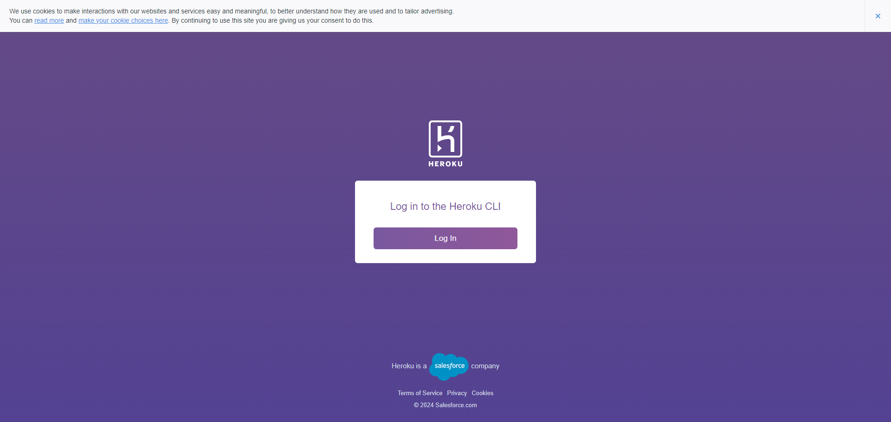

# Version 1.0.1

**Goal**: Deploy the app to a web server using Heroku instead of running it locally.

## Updates and Changes

- **Setup Heroku** as the hosting platform for the application.

- **Installed the Heroku CLI** to manage and deploy the Flask application.

- **Created a Heroku app** using the Heroku CLI and linked it to the project repository.

- **Generated `requirements.txt`** to include all dependencies required for deployment.

- **Created a `Procfile`** to specify how Heroku should run the Flask application using Gunicorn.

- **Deployed the application to Heroku** and tested it to ensure it's running on the web server.

### Running Locally (Optional)

If you want to run your Flask app on your local machine using the web server setup (instead of just `flask run`), you can use `gunicorn` to simulate the Heroku environment.

---

## Deploying the Application to Heroku

### Setup Heroku

- **Go to**  and sign up for an account.

- **Add the Payment method** to your Heroku account. (Note: You won’t be charged unless you exceed the free tier limits.)

### Install Heroku CLI

- Visit the  to download and install the Heroku CLI.

- Once installed, you can access Heroku commands from any terminal, including Git Bash. This allows you to seamlessly use Heroku commands alongside your usual Git commands.


### Deploying to Heroku

**Step 1: Lot in to Heroku**

1. Open Git Bash or your terminal and log in to Heroku using the CLI:

```bash
heroku login
```
This command will open a browser window prompting you to log in to your Heroku account.



**Step 2: Prepare Your Project for Deployment**

1. Create a `requirements.txt` file with all the dependencies

```bash
pip freeze > requirements.txt
```

2. Create a `Procfile` in the root directory to specify how Heroku should run your application:

```makefile
web: gunicorn app:app
```
- This tells Heroku to use Gunicorn to run your Flask application.

- Replace `app` with the name of your main Python file (without the `.py` extension).

**Step 3: Deploy Your Application**

1. Make sure your Git repository is initialized and all changes are committed.

```bash
git add .
git commit -m "Prepare for Heroku deployment"
```

2. Create a Heroku app:

```bash
heroku create menu-flask-app
```

3. Deploy your application to both Git Hub Heroku:

```bash
git push origin main
git push heroku main
```

## How Heroku Uses the Procfile

- The `Procfile` ensures that Heroku runs your Flask application using Gunicorn in a production environment, so you don't need to run Gunicorn manually on Heroku. 

## Optional: Running Gunicorn Locally

You might want to test how your Flask app behaves in a production environment on your local machine. This simulates how it will run on Heroku.

1. Install Gunicorn

```bash
pip install gunicorn
```

2.  Run the Flask app using Gunicorn:

```bash
gunicorn app:app
```