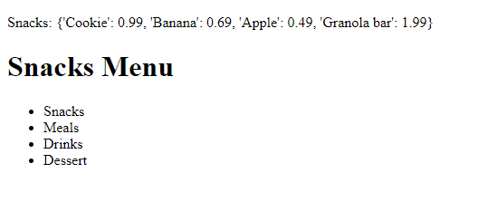

# Version 1.0.2

**Goal**: Implement a data source for the application using a `menu` dictionary and test the app with **Jinja2 templating**, which allows the inclusion of logic and code-like constructs within the template using special syntax.


### Updated `app.py`
```python
from flask import Flask, render_template

app = Flask(__name__)

menu = {
    "Snacks": {
        "Cookie": .99,
        "Banana": .69,
        "Apple": .49,
        "Granola bar": 1.99
    },
    "Meals": {
        "Burrito": 4.49,
        "Teriyaki Chicken": 9.99,
        "Sushi": 7.49,
        "Pad Thai": 6.99,
        "Pizza": {
            "Cheese": 8.99,
            "Pepperoni": 10.99,
            "Vegetarian": 9.99
        },
        "Burger": {
            "Chicken": 7.49,
            "Beef": 8.49
        }
    },
    "Drinks": {
        "Soda": {
            "Small": 1.99,
            "Medium": 2.49,
            "Large": 2.99
        },
        "Tea": {
            "Green": 2.49,
            "Thai iced": 3.99,
            "Irish breakfast": 2.49
        },
        "Coffee": {
            "Espresso": 2.99,
            "Flat white": 2.99,
            "Iced": 3.49
        }
    },
    "Dessert": {
        "Chocolate lava cake": 10.99,
        "Cheesecake": {
            "New York": 4.99,
            "Strawberry": 6.49
        },
        "Australian Pavlova": 9.99,
        "Rice pudding": 4.99,
        "Fried banana": 4.49
    }
}

@app.route("/")
@app.route("/home")
def home():
    return render_template('home.html', menu=menu)  # Pass the menu dictionary to the template

if __name__ == "__main__":
    app.run(debug=True)

```

### Explanation

- Implemented a `menu` dictionary to serve as the data source for the application's menu items.

- The line `return render_template('home.html', menu=menu)` passes the `menu` dictionary to the `'home.html'` template.  Now, the template can access the `menu` variable. 

### Updated `home.html`

Your HTML file can now use the menu dictionary correctly:

```html
<!DOCTYPE html>
<html lang="en">
<head>
    <meta charset="UTF-8">
    <meta name="viewport" content="width=device-width, initial-scale=1.0">
    <title>Menu</title>
</head>
<body>
    <h1>Snacks Menu</h1>
    <p>Snacks: {{ menu['Snacks'] }}</p>
    
    <h2>Menu Categories</h2>
    <ul>
        
            <li>{{ category }}</li>
        
    </ul>
</body>
</html>
```

### Results


### Summary

- In your `app.py` file, pass the `menu` dictionary to `render_template`.

- Your template will now have access to the `menu` variable, and you can use it as needed within your HTML using Jinja2 templating syntax.