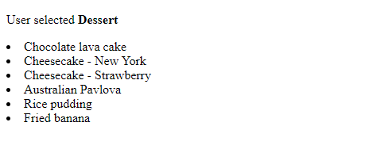

# Version 1.0.3

**Goal**:  Implement the functionality to pass the selected category from the `/home` page to a separate route using a `POST` request. This update allows the user to select a category and submit it to the backend, where the selected category is processed. The items for that category are then passed to `category.html` and displayed, allowing users to see all available items for the chosen category.

---

## Updated `app.py`

The following route was added to handle the selected category:

```python
@app.route("/category", methods=["POST"])
def select_category():
    selected_category = request.form.get("category")
    items = menu[selected_category]
    return render_template("category.html", category=selected_category, items=items)
```

### Explanation

- A new route `/category` was created to handle the `POST` request sent from the form on the home page (`/home`).

- The `select_category()` function retrieves the selected category using `request.form.get("category")`.

- The items corresponding to this category are extracted from the `menu` dictionary and passed to the `category.html` template using `render_template`.

---

## Updated `home.html`

A form was added to allow users to select a category and submit it to the backend using a POST request:

```html
    div id="category-section">
        <form action="{{url_for('select_category')}}" method="POST">
            
                <input type="radio" name="category" value={{category}}>{{category}}<br>
            
            <br>
            <input type="submit" value="Submit">
        </form>    
    </div>
```
---

## Updated `category.html`

The template was updated to display the items for the selected category:

```html
<body>
    <h1>Welcome to the variety food truck.</h1>

    <div id="category-section">
        <form action="{{url_for('select_category')}}" method="POST">
            
                <input type="radio" name="category" value={{category}}>{{category}}<br>
            
            <br>
            <input type="submit" value="Submit">
        </form>    
    </div>
 
</body>
```
---

## Results


**Route**: `/home`


**Route**: `/category`



---

## Summary

- The `POST` method is used to pass the user's category selection from the `/home` page to the backend.

- The selected category is processed, and the corresponding items are displayed in the `category.html` template.

- These updates demonstrate how to handle form submissions, retrieve data on the backend, and dynamically display it using a template.