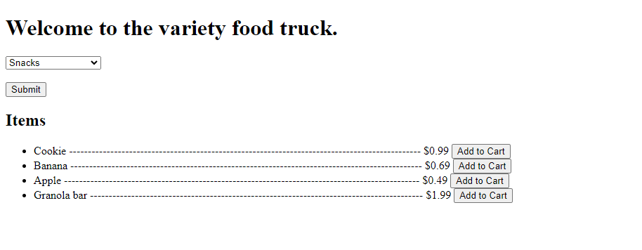

# Version 1.0.4

**Goal**: Implement  functionality to retrieve data from the backend using a javascript fetch call and display it on the same page. 

**Files involved**

- **home.html** - Utilizes jinja2 templating to generate UI data retrieved from `app.py`.  Javascript code is implemented to fetch data from the backend which is stored as a python object in `app.py`

    - shifted in how form submission is handled and user interaction

- **app.py** - contains the `/get-items` that processs client requests via a `POST` request. 

--

## Updates on `home.html`

### Jinja2 templating

### Original Code 

```html
    <form action="{{url_for('select_category')}}" method="POST">       
```
**Form Submission**: The `form` element uses the `action` attribute to specify that the data should be sent to the `select_category` route when the form is submitted.

**Radio Buttons**: The radio buttons are used for the user to select one category.  The selected category will be sent to the backend when the form is submitted

### Updated code

```html
 <div id="category-section">
        <form id="category-form">
            <select name="category" id="category">
                <option value=""disabled selected hidden>Choose a category</option>
                
                    <option value={{category}}>{{category}}</option>
                
            </select>
            <br><br>
            <input type="submit" value="Submit">
        </form>    
    </div>
```

**Event Listener**: Changed the way form is submitted to an event listener.  By changint hte form to use an `id` instead of an `action`, we are planning to use Javascript to handle form submissions dynamically.  An even listener is added to `#category-form` to handle the submission event.

**Select Dropdown**: Changed the way user selects the categories to a drop down. 

```html
    <div id="items-section">
        <h2>Items</h2>
        <ul id="items-list"></ul>
    </div>
```
- `#items-section` is designed to display the data we retrieve from the backend. 

### Javascript Code

**Code Breakdown**

```js

    document.getElementById('category-form').addEventListener('submit', function(event) {
        event.preventDefault();
        const formData = new FormData(event.target);
        const selectedCategory = formData.get('category');
    });

```

**Explanation**
This code block is designed to retrieve the selected value from the form element:

**Event Listener**: An event listener is added to `#category-form` to listen for the `submit` event.

- Added the event listener to `#category-form`

```js
event.preventDefault();
```
- This method prevents the default submission behavior of the form, allowing for custom handling of the data.

```js
const formData = new FormData(event.target);
```
- This line creates a new `FormData` object from the submitted form, which includes all the input values

```js
const selectedCategory = formData.get('category');
```
- This retrievs the value of the input element with name `category`

Now that we have the selected category, we need to make a request to the server to retrieve all the data associated with that category.

```js
    fetch('/get-items', {
        method: 'POST',
        headers: {
            'Content-Type': 'application/x-www-form-urlencoded',
        },
        body: new URLSearchParams({category: selectedCategory}),
    })
```
**Explanation**
This code block is designed to send a request to the server `/get-items` route:

`fetch()` takes in two arguments:

1.  **route**: the route we are hitting in the backend

2.  **Request Object**: This object contains three keys:
        - `method`:  Specifies the HTTP method to be used (in this case, `POST`).

        - `headers`: An object that includes  `'Content-Type': 'application/x-www-form-urlencoded'`, indicating the format of the data being sent.

        - `body`: Uses `new URLSearchParams()` to format the body of the request, with the selected category being passed as a parameter.  Note that key is arbitrary. I could have any name you want it to be.  


At this stage, we will be waiting for the server to process the request and return the response. This will be detailed in the notes for updating `app.py`.

Once the data is recieved 

```js
.then(response => response.json())
```
- The server returns a `JSON` string, so here we are converting that response to a json object which allows us to easily retrieve and work with data.

Once the data is in JSON object format, we can utilize it to update the UI

```js
   
        .then(data => {
           // // Use the data object to manipulate the UI as required
        }); 
```
- We are using an `arrow function` to handle the data processing

**Populating the data to UI**

```js
    const itemsList = document.getElementById('items-list');
    itemsList.innerHTML = ''; // Clear the list first
```

- We target `#items-list` because that's where we want to populate our data

- Next, we clear any existing data.  

Now we have to loop through the data object:
    - create <li> element
    
    - Then, structure the HTML to format the data with the appropriate elements: item name, price, and "Add to Cart" button.


```js
    data.items.forEach(item => {
        const listItem = document.createElement('li');
        
        
        listItem.innerHTML = `
        
        <span>${item.name}<span>
        <span>${'-'.repeat(100-(item.name).length)}</span>
        <span>$${item.price}${(' '.repeat(5))}</span>
        <button onclick="addToCart('${item.name}', ${item.price})">Add to Cart</button>`;
        
        itemsList.appendChild(listItem);
    });
```

- The `.repeat(<integer>)` method will repeat the string the specified number of times.

## Updates on `app.py`

```python
@app.route("/get-items", methods=["POST"])
def get_items():
    # code that processes the request
```
- We are creating the `/get-items` route to handle the `POST` request. 

- Next, we define the code to process the request within `get_items()` function

First, we want to access the data in body of the fetch call

```python
    from flask import request
    selected_category = request.form.get("category")
```
- The `request.form.get()` method enables us to retrieve the value of the `category` key from the `URLSearchParams` sent in our fetch call.

- To use this method we need to import the `request` object from the `flask` library. 

Since the request is related to the `selected_category`, the user wants to see the menu items for that category. Therefore, we need to retrieve those items first.

Given that our data is structured as a Python object, we can easily access the items with the following line:

```python
    items = menu[selected_category]
```
- This retrieves all the data associated with the `selected_category` key. Next, we need to loop through this data to create an object for each item, including its price.

```python
item_list = [
    {"name": key, "price": value} if not isinstance(value, dict) else {"name": f"{key} - {subkey}", "price": subval} 
                for key, value in items.items() for subkey, subval in (value.items() if isinstance(value, dict) else [(key, value)])]
```
- This line uses **list comprehension** to construct a list by applying an expression to each item in the iterable, with optional filtering based on a condition.

- The `isinstance()` method checks if the specified item is an instance of a dictionary.

- In this context, we construct an object with the keys `name` and `price` when the value is not a dictionary. If it is a dictionary, we concatenate `key` and `subkey` for the `name` while also looping through the sub-key and its value. 

---
## Results



---

## Additional Notes

**Asynchronous Behavior**:  Using Javascript to handle the submission allows us to use `fetch` to send the data to the server asynchronously.  This means the page can remain responsive, and you can update parts of the UI based on the server response without needing to reload the entire page.  

