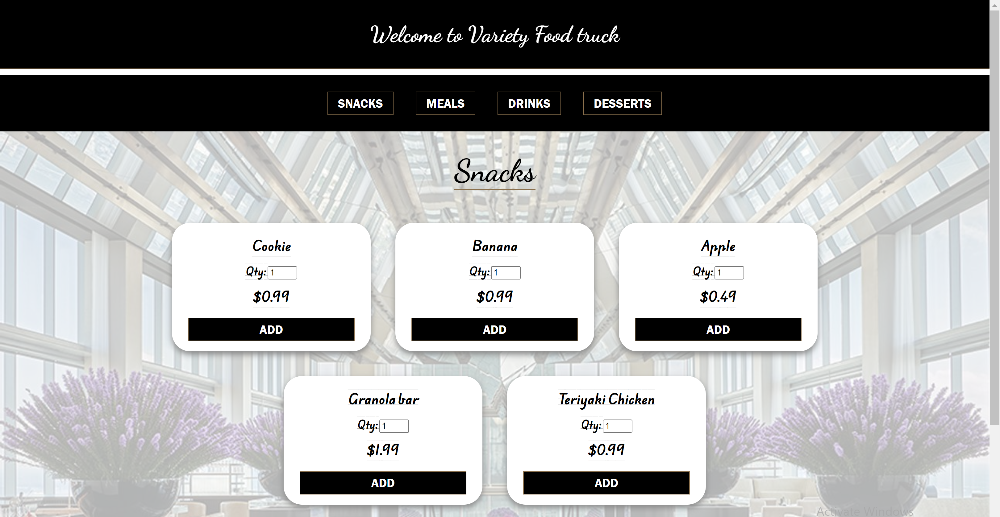

# Version 1.0.6

**Goal**:  Implement media queries to ensure the responsive layout adapts seamlessly across a wide range of screen sizes and devices.

## New Files

**CSS**
    - `style-mobile.css`
    - `style-ipad.css`
    - `style-desktop.css`

---

1. **Mobile View**

    - Screen Width: 320px to 480px (phones in portrait mode)

    - Breakpoint Range: max-width: 480px

    - Common Devices: small smartphones

2. **Tablet View (iPad View)**

    - Screen Width: 481px to 1024px

    - Breakpoint Range: min-width: 481px and max-width: 1024px

    - Common Devices: tablets, and large smartphones in landscape mode
    
3. **Desktop View**

    - Screen Width: 1025px and above

    - Breakpoint Range: min-width: 1025px

    - Common Devices: Laptops, desktop monitors, and large tablets in landscape mode

---

Link the stylesheets to the `html` document. 

```html
<head>
    <!-- Base Stylesheet -->
    <link rel="stylesheet" href="/static/css/style.css">

    <!-- Mobile Stylesheet -->
    <link rel="stylesheet" href="/static/css/style-mobile.css" media="screen and (max-width: 480px)">

    <!-- Tablet Stylesheet -->
    <link rel="stylesheet" href="/static/css/style-mobile.css" media="screen and (min-width: 481px) and (max-width: 1024px)">

    <!-- Desktop Stylesheet -->
    <link rel="stylesheet" href="/static/css/style-desktop.css" media="screen and (min-width: 1025px)">
</head>
```

## Results

### Mobile View Results


### Tablet View Results


### Desktop View Results




