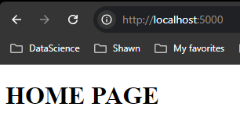

# Version 1.0.0

## Changes
- Integrate HTML templates using `render_template`

## Modification to `app.py`

### Python Code Block
```python
from flask import Flask, render_template

app = Flask(__name__)

@app.route("/")
@app.route("/home")
def home():
    return render_template('home.html')

if __name__ == "__main__":
    app.run(debug=True)

```
### Code Breakdown
1. Imported render_template function from flask

```
from flask import Flask, render_template
```

- `render_template`: A function that allows you to serve HTML templates from your project's directory.  This is used to render HTML files that include dynmaic content generated by Python

2. Defining routes

```
@app.route("/")
@app.route("/home")
def home():
    return render_template('home.html')

```

- `@app.route("/")` and `@app.route("home")`: These route decorators define two routes for your web application: `/` (the root URL) and `/home`. This means accessing either url `http://127.0.0.1:5000` or `http://127.0.0.1:5000/home` will trigger `home()` function.

- `home()` function:  This function is executed when the above routes are accessed.  It uses `render_template('home.html')` to serve the `home.html` file as the response.

## How `render_template('home.html')` Works

- `render_template('home.html')`: This function looks for the home.html file inside a folder named templates in the root directory of your project.

- Flask follows a specific structure where all HTML templates should be placed inside a folder named templates. This allows Flask to easily find and serve these files.

## Project Structure

To ensure Flask can locate the `home.html` template, you need to organize your project as follows:

```
menu-project/
│
├── app.py               # Your main Flask application file
│
└── templates/           # The templates folder (must be named 'templates')
    └── home.html        # Your HTML template file

```

## Adding Basic HTML Code to `home.html`

### HTML Code Block
```markdown
```html
<!-- home.html -->
<!DOCTYPE html>
<html lang="en">
<head>
    <meta charset="UTF-8">
    <meta name="viewport" content="width=device-width, initial-scale=1.0">
    <title>Home Page</title>
</head>
<body>
    <h1>Welcome to the Home Page!</h1>
    <p>This is a test page to confirm that Flask is rendering templates correctly.</p>
</body>
</html>
```

## Result


## Summary

- You used render_template to render HTML pages, integrating Python code with HTML.

- The templates folder is essential for Flask to locate your HTML files.

- The project structure and organization ensure that the Flask application works as expected.


